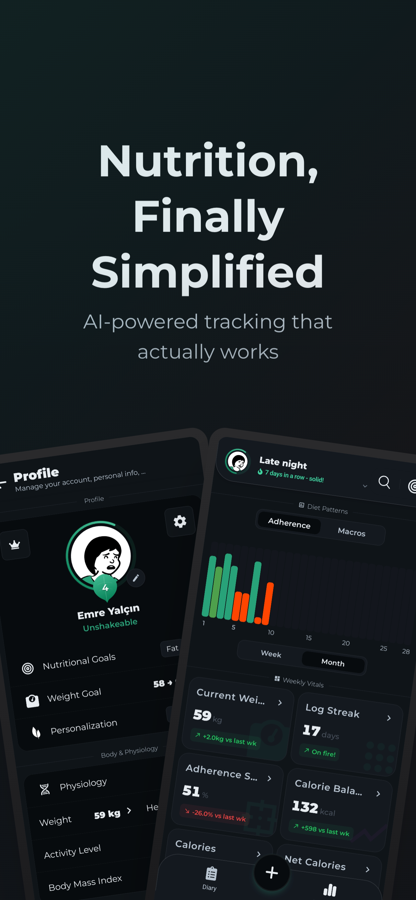
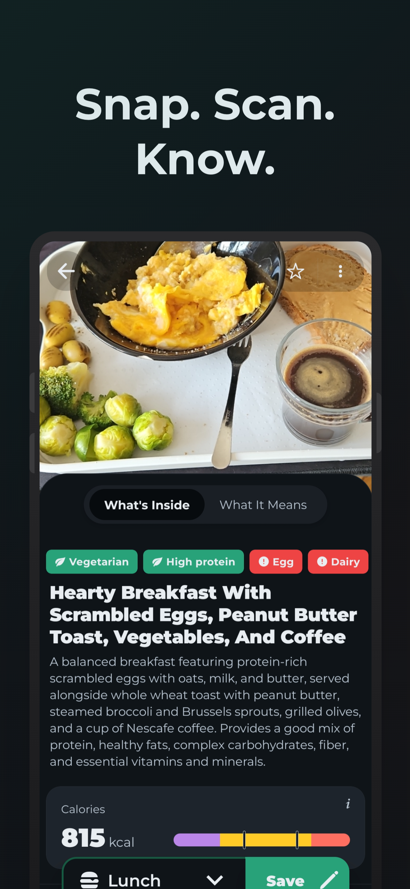
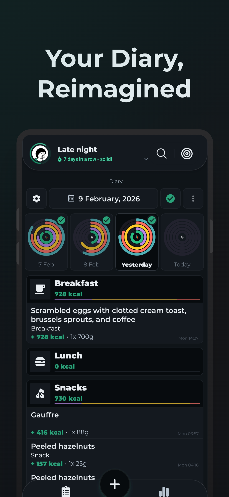
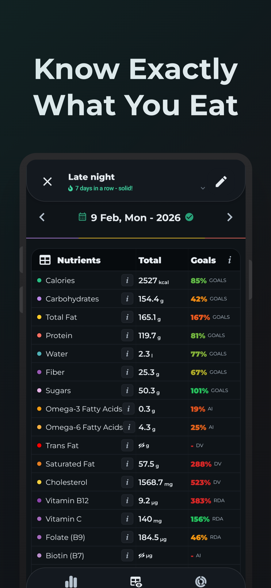
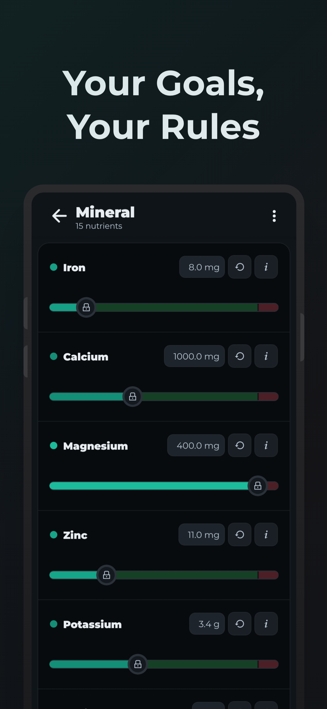

# Nutrivine

**Eat smarter, live better.**

Nutrivine is a free, AI-powered nutrition and health tracking app for iOS and Android. We make healthy eating simple, accessible, and free from unnecessary paywalls - providing expert nutritional guidance without expensive dietitians or frustrating subscriptions.

  
  
  
  
  

## Features

**Nutrition Tracking**
- Food logging via barcode scan, meal photo analysis, voice input, or search
- 60+ nutrients tracked with DRI-based goals
- 80+ activity types with calorie tracking
- Custom foods, portions, and measurement units

**Health Integrations**
- Apple HealthKit, Google Health Connect, Samsung Health
- Strava and Garmin
- Steps, sleep, heart rate, HRV, and recovery score tracking
- Active calorie adjustment and sleep-aware meal timing

**AI-Powered Insights**
- Nutrition chat assistant for personalized advice
- Meal photo analysis for instant nutrient estimation
- Smart food search

**Dashboard & Analytics**
- Customizable widget dashboard with charts and trends
- Streak tracking, achievements, and gamification
- Day completion filters for accurate statistics

**9+ Languages** - and growing

## Links

- **Website**: [nutrivine.app](https://nutrivine.app)
- **App Store**: [Download for iOS](https://apps.apple.com/app/id6753625715)
- **Google Play**: [Download for Android](https://play.google.com/store/apps/details?id=com.nutrivine)
- **Instagram**: [@getnutrivine](https://www.instagram.com/getnutrivine)
- **Contact**: [contact@nutrivine.app](mailto:contact@nutrivine.app)
